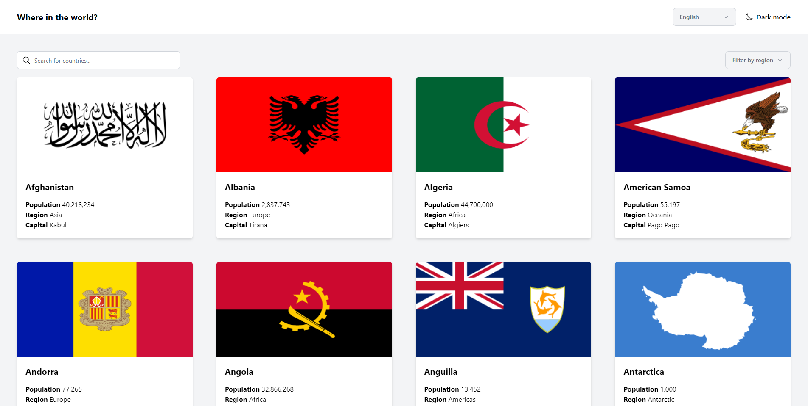
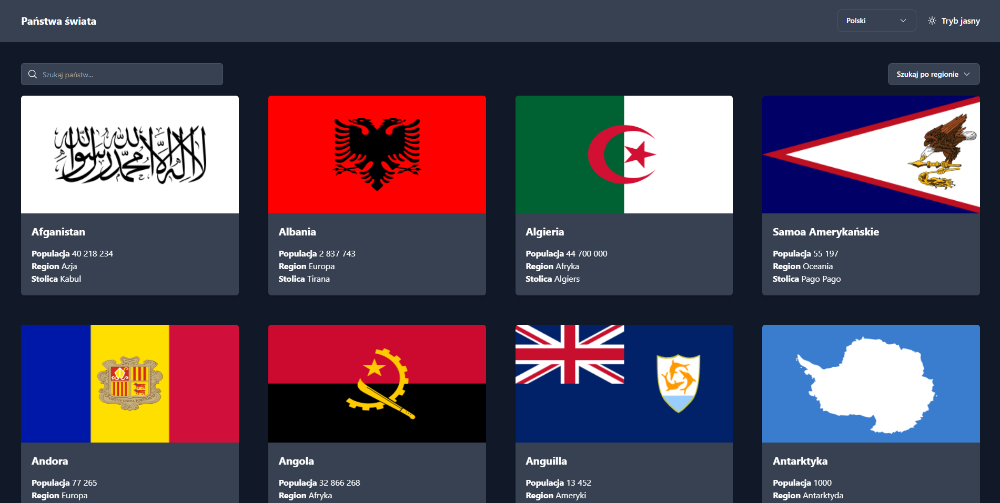
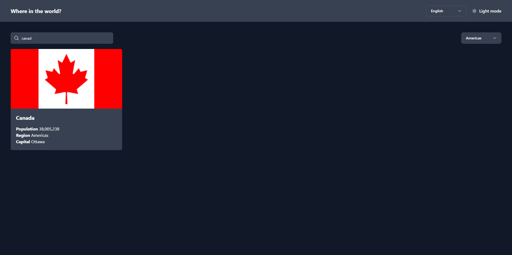
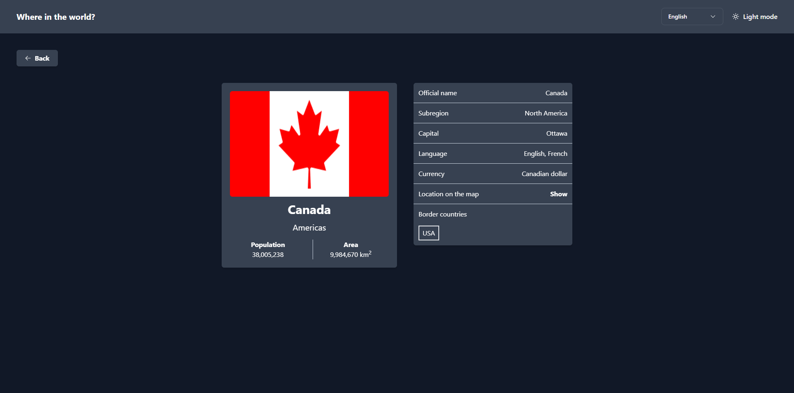
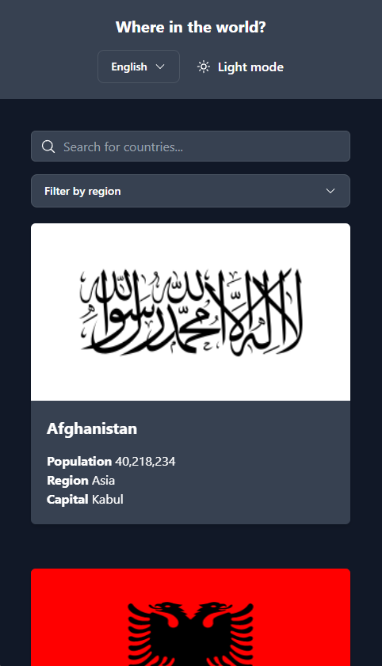
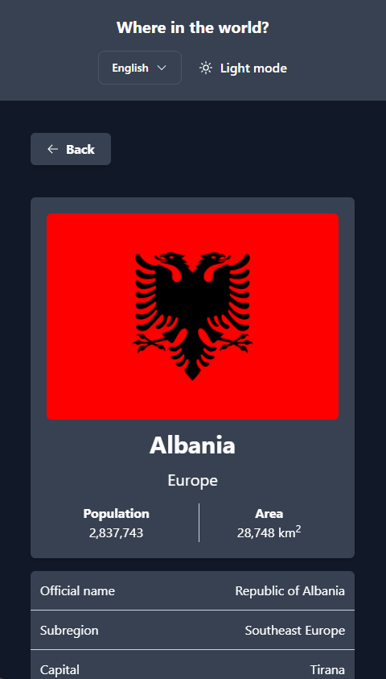

<h1 align="center">
    
    REST COUNTRIES API
</h1>


Simple and responsive website about countries using REST Countries API with color theme switch and multilingual support. 

<p align="center">
    <a href="#features">Features</a>&nbsp;&nbsp; | &nbsp;
    <a href="#getting-started">Getting started</a>&nbsp; | &nbsp;
    <a href="#used-technologies-and-tools">Technologies and tools</a>&nbsp; | &nbsp; 
    <a href="#screenshots">Screenshots</a>&nbsp; | &nbsp;
    <a href="#license">License</a>
</p>

# Features
- provides information about countries from REST Countries API
- search countries by common name (in all supported languages) and filter by region
- see country details
- dark and light style theme available
- multilingual support (available now: English and Polish)
- remembers user settings (style theme and language)

# Getting started
1. Clone this repo
```
git clone https://github.com/krzysztofhewelt/rest-api-countries
```
2. Install dependencies
```
npm install
```
3. Run dev server
```
npm run dev
```
4. Open http://127.0.0.1:5173/ with your browser to launch the app.

# Used technologies and tools
- HTML5
- Tailwind CSS v3.2.4
- Vue 3 and libraries:
    - Vuex
    - Axios
    - Lodash
    - vue-router
    - v-lazy-image
- bundler: vite
- code formatting: ESLint and Prettier
- IDE: Jetbrains WebStorm

# Screenshots







# License
Distributed under the MIT License.
